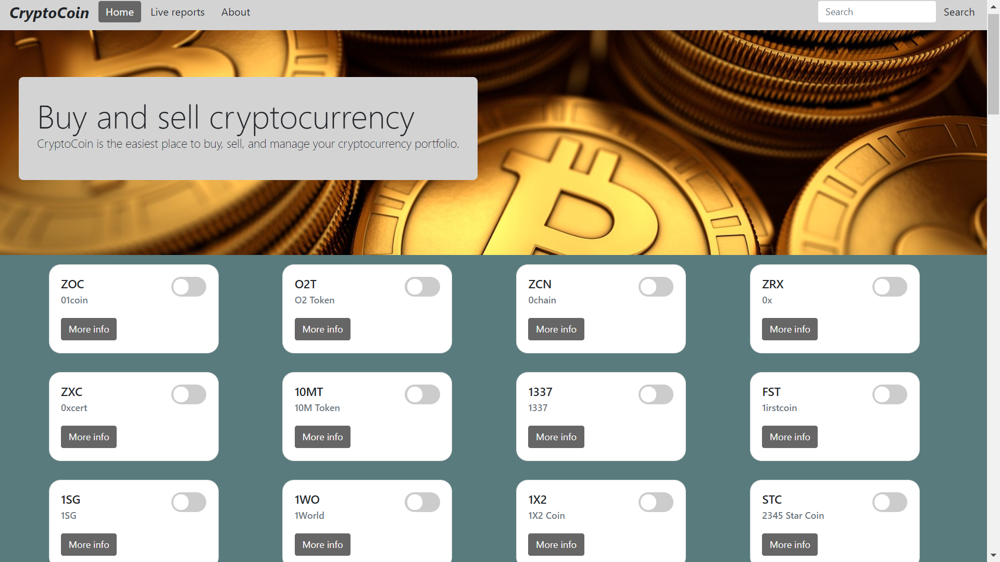
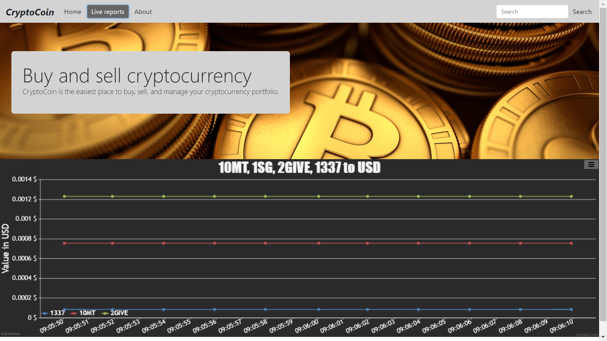

# Crypto-coin
CryptoCoin is your window into the world of cryptocurrency, gathering data from more than 100 exchanges to bring you real-time prices and historical charts for over 3,000 coins. You can add your favourite cryptocurrencies to a handy watchlist, making it easy to follow the coins that are most relevant to you.

## Built With:
HTML, SCSS, Javascript, jQuery, AJAX, Bootstrap, Canvas.js, 

## Screenshot:

## Getting Started
no additional installs

## Authors
Tal Diamant-Sabag